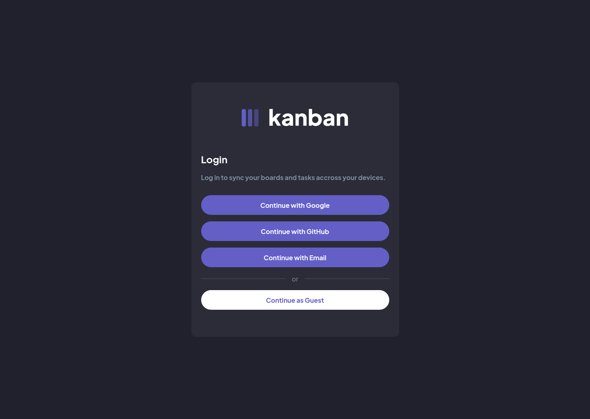

# Kanban Task Management

Authentication page

Home page

Task management app where users can create, update, read and delete boards and tasks.
This was a challenge from [Frontend Mentor](https://www.frontendmentor.io/).

[Live Demo](https://kanban-web-app-eta.vercel.app/) 

## Built with

- 
- 
- 

## Author

- Frontend Mentor - [@abedfetrat](https://www.frontendmentor.io/profile/abedfetrat)
- Twitter - [@abedfetrat](https://www.twitter.com/abedfetrat)
- LinkedIn - [@abedfetrat](https://www.linkedin.com/in/abedfetrat)
